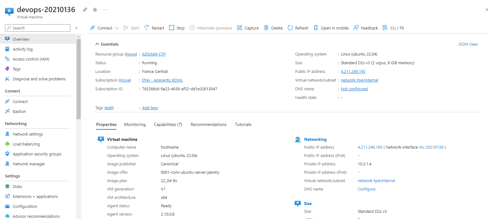

# Rapport TP4 - DEVOPS

### Objectifs
- Créer une machine virtuelle Azure (VM) avec une adresse IP publique dans un réseau existant (network-tp4)
- Utiliser Terraform
- Se connecter à la VM avec SSH
- Comprendre les différents services Azure (ACI vs. AVM)
- Mettre à disposition son code dans un repository Github

Help : [Documentation Terraform Azure CLI](https://registry.terraform.io/providers/hashicorp/azurerm/latest/docs/guides/azure_cli#loggin g-into-the-azure-cli)

### Contraintes
- Location : france central
- Azure Subscription ID : 765266c6-9a23-4638-af32-dd1e32613047
- Azure resource group : ADDA84-CTP
- Network : network-tp4
- Subnet : internal
- Azure VM name: devops-<identifiant-efrei>
- VM size : Standard_D2s_v3
- Utiliser Azure CLI pour l'authentification
- User administrateur de la VM : devops
- Créer une clef SSH avec Terraform
- OS : Ubuntu 22.04

### Livrables
- URL repository Github (avec le code terraform)
- Rapport qui présente, étape par étape, les choix techniques et les difficultés rencontrées si vous n'avez pas pu aller jusqu'au bout. Commenter également l'intérêt de l'utilisation de Terraform pour déployer des ressources sur le cloud plutôt que la CLI ou l'interface utilisateur.
- A envoyer par mail au plus tard 24h après le TP à vincent.domingues@intervenants.efrei.net avec comme objet: [TP4-DEVOPS] NOM PRENOM

### Notation
- Code disponible sur Github
- `terraform apply` et `terraform destroy` qui fonctionnent
- Commande suivante qui fonctionne avec l'adresse publique de votre VM : `ssh -i id_rsa devops@{PUBLIC_ADDRESS_IP} cat /etc/os-release`

### Bonus
- Lancer un script au démarrage de la machine qui installe Docker avec cloud-init
- Aucune duplication de code (utilisation de variables)
- Code Terraform correctement formaté (me donner la commande utilisée)

## Introduction
Dans le cadre du TP4 de DevOps, l'objectif était de déployer une machine virtuelle Azure (VM) en utilisant Terraform pour automatiser le processus. Le déploiement comprend la création d'une VM Ubuntu 22.04 avec une adresse IP publique, l'installation de Docker au démarrage de la machine, et l'utilisation d'une clé SSH pour l'authentification.

## Réalisation

- Terraform :
  - Création des ressources Azure telles que le réseau, l'adresse IP publique, la clé SSH et la machine virtuelle.
  - Utilisation de variables pour la personnalisation et la réutilisation du code.
  - Formatage du code avec la commande `terraform fmt`.

- Azure : 
  - Utilisation de Azure CLI pour l'authentification.
  - Création d'une machine virtuelle

- Docker : 
  - Installation de Docker sur la VM Ubuntu avec un script au démarrage.

## Prérequis : 

Pour ce TP, il était important d'installer AZ Cli et Terraform.

## Fichiers utilisés : 

### main.tf
Ce fichier contient la configuration des ressources Azure à déployer, telles que le network, l'adresse IP publique, la clé SSH et la VM elle-même. 

```tf
data "azurerm_virtual_network" "existing" {
  name                = var.virtual_network_name
  resource_group_name = var.resource_group_name
}

data "azurerm_subnet" "existing" {
  name                 = var.subnet_name
  virtual_network_name = data.azurerm_virtual_network.existing.name
  resource_group_name  = var.resource_group_name
}

data "azurerm_resource_group" "existing" {
  name = var.resource_group_name
}

resource "azurerm_network_interface" "main" {
  name                = var.network_interface_name
  location            = var.resource_group_location
  resource_group_name = var.resource_group_name

  ip_configuration {
    name                          = "internal"
    subnet_id                     = data.azurerm_subnet.existing.id
    private_ip_address_allocation = "Dynamic"
    public_ip_address_id          = azurerm_public_ip.main.id
  }
}

resource "azurerm_public_ip" "main" {
  name                = var.public_ip_name
  location            = var.resource_group_location
  resource_group_name = var.resource_group_name
  allocation_method   = "Dynamic"
}
```
On génère ici la clé publique et privée ssh et on store dans des fichiers locauxces clés

``` tf
resource "tls_private_key" "ssh" {
  algorithm = "RSA"
  rsa_bits  = 4096
}


resource "local_file" "public_key" {
  content  = tls_private_key.ssh.public_key_openssh
  filename = "${path.module}/id_rsa.pub"
}

resource "local_file" "private_key" {
  content         = tls_private_key.ssh.private_key_pem
  filename        = "${path.module}/id_rsa"
  file_permission = "0600"
}

```

Cette partie permet de créer la machine virtuelle 

``` tf
resource "azurerm_linux_virtual_machine" "main" {
  name                  = var.virtual_machine_name
  location              = var.resource_group_location
  resource_group_name   = var.resource_group_name
  network_interface_ids = [azurerm_network_interface.main.id]
  size                  = "Standard_D2s_v3"

  os_disk {
    caching              = "ReadWrite"
    storage_account_type = "Standard_LRS"
  }

  source_image_reference {
    publisher = "Canonical"
    offer     = "0001-com-ubuntu-server-jammy"
    sku       = "22_04-lts"
    version   = "latest"
  }

  computer_name                   = "hostname"
  admin_username                  = "devops"
  disable_password_authentication = true

  admin_ssh_key {
    username   = "devops"
    public_key = file("${var.ssh_key_path}/id_rsa.pub")
  }


```
Egalement, la VM est configurée pour installer Docker au démarrage en utilisant le script install_docker.sh.

``` tf
  custom_data = base64encode(templatefile("${path.module}/install_docker.sh", {}))
}

```

### variables.tf

Ce fichier définit les variables utilisées dans le déploiement, telles que la subscription ID d'Azure, le nom de la ressource, et le chemin de la clé SSH et d'autres variables.

``` tf 

variable "subscription_id" {
  default     = "765266c6-9a23-4638-af32-dd1e32613047"
  description = "Azure subscription ID."
}

variable "resource_group_location" {
  default     = "francecentral"
  description = "Location of the resource group."
}

variable "virtual_network_name" {
  default     = "network-tp4"
  description = "Name of the existing virtual network."
}

variable "resource_group_name" {
  default     = "ADDA84-CTP"
  description = "Name of the existing resource group."
}

variable "subnet_name" {
  default     = "internal"
  description = "Name of the existing subnet."
}

variable "network_interface_name" {
  default     = "nic-20210136"
  description = "Name of the network interface."
}

variable "public_ip_name" {
  default     = "publicip-20210136"
  description = "Name of the public IP."
}

variable "virtual_machine_name" {
  default     = "devops-20210136"
  description = "Name of the virtual machine."
}

```

### providers.tf

Ce fichier configure les providers Terraform, en spécifiant la version d'AzureRM et en désactivant l'enregistrement automatique du fournisseur.

```tf
terraform {
  required_version = ">=1.0"

  required_providers {
    azurerm = {
      source  = "hashicorp/azurerm"
      version = "~>3.0"
    }
    random = {
      source  = "hashicorp/random"
      version = "~>3.0"
    }
  }
}

provider "azurerm" {
  features {}
  subscription_id            = var.subscription_id
  skip_provider_registration = true
}
```

### install_docker.sh 

Ce fichier permet d'installer Docker sur la VM Ubuntu sur Azure. 

``` sh 

#!/bin/bash

sudo apt-get update

sudo apt-get install -y \
    apt-transport-https \
    ca-certificates \
    curl \
    gnupg \
    lsb-release

curl -fsSL https://download.docker.com/linux/ubuntu/gpg | sudo gpg --dearmor -o /usr/share/keyrings/docker-archive-keyring.gpg

echo \
  "deb [arch=amd64 signed-by=/usr/share/keyrings/docker-archive-keyring.gpg] https://download.docker.com/linux/ubuntu \
  $(lsb_release -cs) stable" | sudo tee /etc/apt/sources.list.d/docker.list > /dev/null

sudo apt-get update
sudo apt-get install -y docker-ce docker-ce-cli containerd.io


sudo usermod -aG docker $USER
```

Ici on met à jour et installe les différents paquets disponibles. On installe les dépendances nécessaires pour que le système utilise les dépôts HTTPS et gère les certificats SSL.

### Formater le code

Pour formater le code on utilise cette commande qui formatera les fichiers nécessaires: 

``` tf
terraform fmt
```

## Création de la VM 

On commence par utiliser la commande qui permet d'initialiser le répertoire de configuration Terraform et mettre à jour les plugins

``` tf
terraform init -upgrade
```

``` tf

Initializing the backend...

Initializing provider plugins...
- Finding hashicorp/random versions matching "~> 3.0"...
- Finding latest version of hashicorp/local...
- Finding latest version of hashicorp/tls...
- Finding hashicorp/azurerm versions matching "~> 3.0"...
- Using previously-installed hashicorp/random v3.6.1
- Using previously-installed hashicorp/local v2.5.1
- Using previously-installed hashicorp/tls v4.0.5
- Using previously-installed hashicorp/azurerm v3.100.0

Terraform has been successfully initialized!

You may now begin working with Terraform. Try running "terraform plan" to see
any changes that are required for your infrastructure. All Terraform commands
should now work.

If you ever set or change modules or backend configuration for Terraform,
rerun this command to reinitialize your working directory. If you forget, other
commands will detect it and remind you to do so if necessary.

```

On utilise ensuite la commande suivante pour générer un plan d'exécution un aperçu des changements que Terraform va apporter à votre infrastructure.

``` tf
terraform plan
```

On obtient 

```tf
data.azurerm_resource_group.existing: Reading...
data.azurerm_virtual_network.existing: Reading...
data.azurerm_resource_group.existing: Read complete after 0s [id=/subscriptions/765266c6-9a23-4638-af32-dd1e32613047/resourceGroups/ADDA84-CTP]
data.azurerm_virtual_network.existing: Read complete after 0s [id=/subscriptions/765266c6-9a23-4638-af32-dd1e32613047/resourceGroups/ADDA84-CTP/providers/Microsoft.Network/virtualNetworks/network-tp4]
data.azurerm_subnet.existing: Reading...
data.azurerm_subnet.existing: Read complete after 1s [id=/subscriptions/765266c6-9a23-4638-af32-dd1e32613047/resourceGroups/ADDA84-CTP/providers/Microsoft.Network/virtualNetworks/network-tp4/subnets/internal]

Terraform used the selected providers to generate the following execution plan. Resource actions are indicated with the following symbols:
  + create

Terraform will perform the following actions:


Plan: 6 to add, 0 to change, 0 to destroy.
```

Finalement on utilise la commande suivante pour exécuter les actions proposées dans un plan Terraform pour créer, mettre à jour ou détruire une infrastructure.

``` tf
terraform apply
```

On obtient 

```tf
data.azurerm_virtual_network.existing: Reading...
data.azurerm_resource_group.existing: Reading...
data.azurerm_virtual_network.existing: Read complete after 0s [id=/subscriptions/765266c6-9a23-4638-af32-dd1e32613047/resourceGroups/ADDA84-CTP/providers/Microsoft.Network/virtualNetworks/network-tp4]
data.azurerm_subnet.existing: Reading...
data.azurerm_resource_group.existing: Read complete after 0s [id=/subscriptions/765266c6-9a23-4638-af32-dd1e32613047/resourceGroups/ADDA84-CTP]
data.azurerm_subnet.existing: Read complete after 1s [id=/subscriptions/765266c6-9a23-4638-af32-dd1e32613047/resourceGroups/ADDA84-CTP/providers/Microsoft.Network/virtualNetworks/network-tp4/subnets/internal]

Terraform used the selected providers to generate the following execution plan. Resource actions are indicated with the following symbols:
  + create

Terraform will perform the following actions:

  # azurerm_linux_virtual_machine.main will be created
  + resource "azurerm_linux_virtual_machine" "main" {
      + admin_username                                         = "devops"
      + allow_extension_operations                             = true
      + bypass_platform_safety_checks_on_user_schedule_enabled = false
      + computer_name                                          = "hostname"
      + custom_data                                            = (sensitive value)
      + disable_password_authentication                        = true
      + disk_controller_type                                   = (known after apply)
      + extensions_time_budget                                 = "PT1H30M"
      + id                                                     = (known after apply)
      + location                                               = "francecentral"
      + max_bid_price                                          = -1
      + name                                                   = "devops-20210136"
      + network_interface_ids                                  = (known after apply)
      + patch_assessment_mode                                  = "ImageDefault"
      + patch_mode                                             = "ImageDefault"
      + platform_fault_domain                                  = -1
      + priority                                               = "Regular"
      + private_ip_address                                     = (known after apply)
      + private_ip_addresses                                   = (known after apply)
      + provision_vm_agent                                     = true
      + public_ip_address                                      = (known after apply)
      + public_ip_addresses                                    = (known after apply)
      + resource_group_name                                    = "ADDA84-CTP"
      + size                                                   = "Standard_D2s_v3"
      + virtual_machine_id                                     = (known after apply)
      + vm_agent_platform_updates_enabled                      = false

      + admin_ssh_key {
          + public_key = (known after apply)
          + username   = "devops"
        }

      + os_disk {
          + caching                   = "ReadWrite"
          + disk_size_gb              = (known after apply)
          + name                      = (known after apply)
          + storage_account_type      = "Standard_LRS"
          + write_accelerator_enabled = false
        }

      + source_image_reference {
          + offer     = "0001-com-ubuntu-server-jammy"
          + publisher = "Canonical"
          + sku       = "22_04-lts"
          + version   = "latest"
        }
    }

Plan: 6 to add, 0 to change, 0 to destroy.

Do you want to perform these actions?
  Terraform will perform the actions described above.
  Only 'yes' will be accepted to approve.

  Enter a value: yes

tls_private_key.ssh: Creating...
tls_private_key.ssh: Still creating... [10s elapsed]
tls_private_key.ssh: Still creating... [20s elapsed]
tls_private_key.ssh: Creation complete after 20s [id=f5984ae83c7490eb3d0113a49bc1255d36789d26]
local_file.public_key: Creating...
local_file.public_key: Creation complete after 1s [id=0a1f651ec0316c82c81540c6264b74c7569dfe0c]
local_file.private_key: Creating...
local_file.private_key: Creation complete after 0s [id=18db813f0951cfe577b05e768f877a3a2076e67d]
azurerm_public_ip.main: Creating...
azurerm_public_ip.main: Creation complete after 2s [id=/subscriptions/765266c6-9a23-4638-af32-dd1e32613047/resourceGroups/ADDA84-CTP/providers/Microsoft.Network/publicIPAddresses/publicip-20210136]
azurerm_network_interface.main: Creating...
azurerm_network_interface.main: Still creating... [10s elapsed]
azurerm_network_interface.main: Creation complete after 12s [id=/subscriptions/765266c6-9a23-4638-af32-dd1e32613047/resourceGroups/ADDA84-CTP/providers/Microsoft.Network/networkInterfaces/nic-20210136]
azurerm_linux_virtual_machine.main: Creating...
azurerm_linux_virtual_machine.main: Still creating... [10s elapsed]
azurerm_linux_virtual_machine.main: Creation complete after 18s [id=/subscriptions/765266c6-9a23-4638-af32-dd1e32613047/resourceGroups/ADDA84-CTP/providers/Microsoft.Compute/virtualMachines/devops-20210136]
```

## VM Azure

On peut ainsi voir la VM sur Azure




## Connection à la VM avec SSH

Pour se connecter à la VM on utilise la commande suivante : 

``` cmd
ssh -i id_rsa devops@4.211.249.195 cat /etc/os-release
```

Cela permet de se connecter à la VM à l'adresse IP publique 4.211.249.195 en utilisant la clé id_rsa privée.

On obtient 

``` cmd
PRETTY_NAME="Ubuntu 22.04.4 LTS"
NAME="Ubuntu"
VERSION_ID="22.04"
VERSION="22.04.4 LTS (Jammy Jellyfish)"
VERSION_CODENAME=jammy
ID=ubuntu
ID_LIKE=debian
HOME_URL="https://www.ubuntu.com/"
SUPPORT_URL="https://help.ubuntu.com/"
BUG_REPORT_URL="https://bugs.launchpad.net/ubuntu/"
PRIVACY_POLICY_URL="https://www.ubuntu.com/legal/terms-and-policies/privacy-policy"
UBUNTU_CODENAME=jammy

```

## Installation de docker

Avec la commande suiante on peut vérifier si docker à été installer 

``` cmd
docker --version
```
Ainsi on peut voir que docker a été installé :

``` cmd
Docker version 24.0.7, build afdd53b
```

## Terraform Destroy 

La commande permet de détruire tous les objets distants gérés par une configuration Terraform particulière.

``` cmd
terraform destroy
```

``` cmd

ls_private_key.ssh: Refreshing state... [id=f5984ae83c7490eb3d0113a49bc1255d36789d26]
local_file.public_key: Refreshing state... [id=0a1f651ec0316c82c81540c6264b74c7569dfe0c]


Terraform used the selected providers to generate the following execution plan. Resource actions are indicated with the following symbols:
  - destroy

Terraform will perform the following actions:


Plan: 0 to add, 0 to change, 6 to destroy.

Do you really want to destroy all resources?
  Terraform will destroy all your managed infrastructure, as shown above.
  There is no undo. Only 'yes' will be accepted to confirm.

  Enter a value: yes

local_file.public_key: Destroying... [id=0a1f651ec0316c82c81540c6264b74c7569dfe0c]
local_file.private_key: Destroying... [id=18db813f0951cfe577b05e768f877a3a2076e67d]
local_file.public_key: Destruction complete after 0s
local_file.private_key: Destruction complete after 0s

Destroy complete! Resources: 6 destroyed.
```

## Conclusion

En conclusion, ce TP4 de DevOps nous a permis d'explorer le déploiement automatisé de ressources Azure à l'aide de Terraform. En suivant les étapes définies, nous avons réussi à créer une machine virtuelle Ubuntu avec une adresse IP publique, installer Docker au démarrage, et nous connecter à la VM via SSH. L'utilisation de Terraform permet une approche cohérente et reproductible pour le déploiement. Ce TP a démontré les avantages de l'automatisation dans la gestion des infrastructures cloud, offrant une solution scalable et maintenable pour le déploiement sur le cloud.
